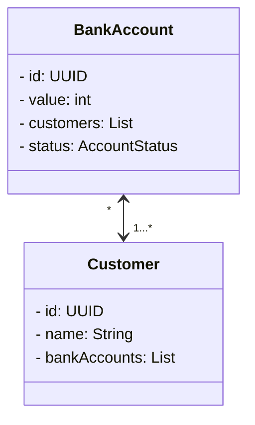
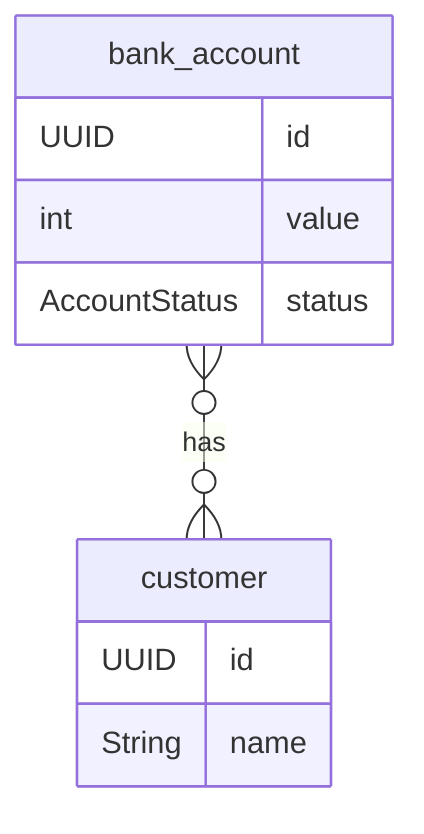
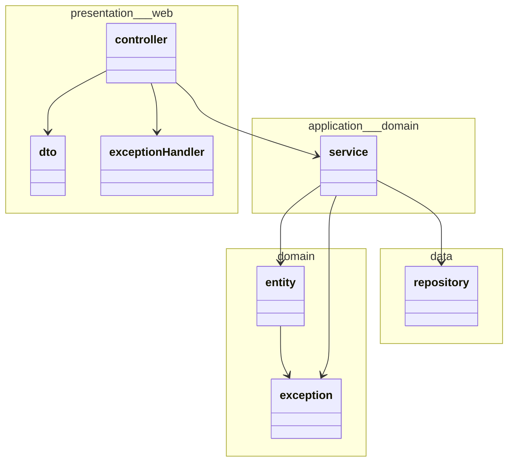

# CNSD Jarno Wieman #1805218

## Docs

This project includes [a swagger ui](http://localhost:8080/docs) to view the API documentation.

## Models

### Domain model

### ERD

### Layer model

In the slides a three-layer architecture is given; however, I am used to working with a four-layer architecture.
I prefer the four-layer architecture as it gives more separation between your business logic and saving data
(single responsibility).
If this is a problem, please let me know.

## Testing

Tests can be run with reports with `mvn test compile org.pitest:pitest-maven:mutationCoverage jacoco:report`, this will
place the reports in the `target` directory.

### Results

## Leerdoelen

- Met AWS werken
- Designen voor de cloud
- NoSQL (Dit is slecht gedaan bij INNO)
- Beter beeld van CD
- Hoe test je een frontend goed
