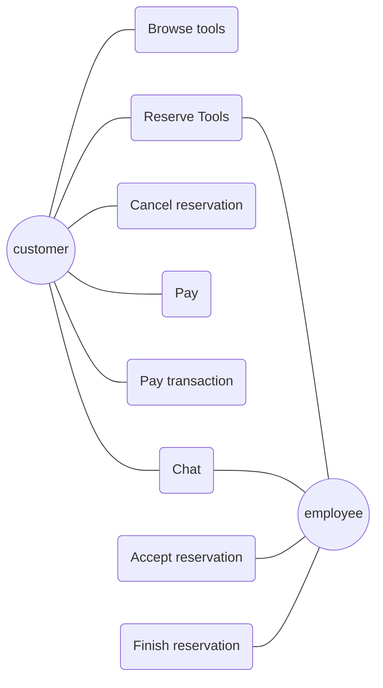
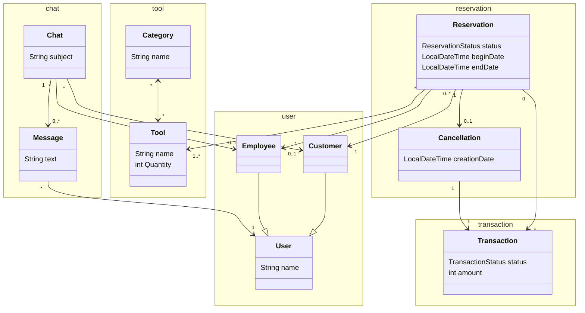
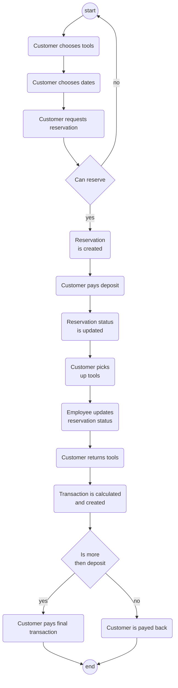
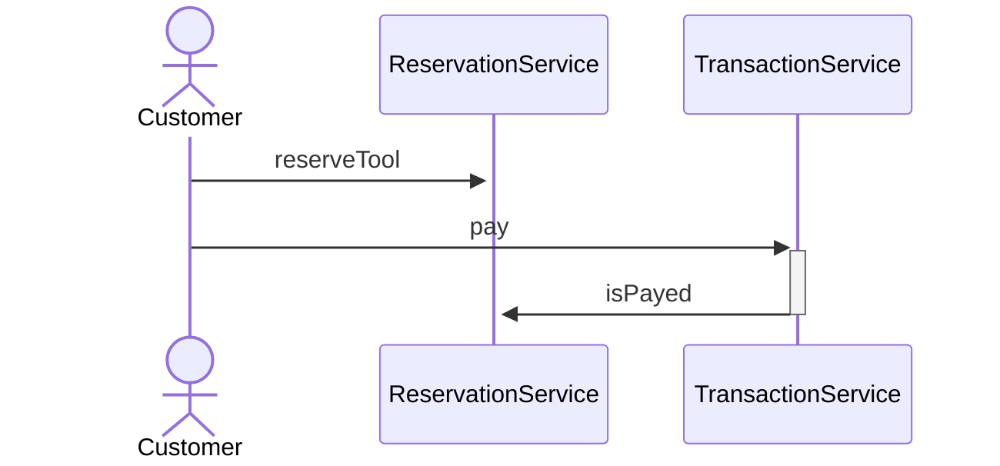

# Use case diagram

```mermaid
flowchart >
    customer(("customer")) --- browse("Browse tools")
    customer --- reserve("Reserve Tools")
    customer --- cancel("Cancel reservation")
    customer --- payDeposit("Pay")
    customer --- payTransaction("Pay transaction")
    customer --- chat("Chat")
    reserve --- employee(("employee"))
    chat --- employee
    acceptReservation("Accept reservation") --- employee
    finishReservation("Finish reservation") --- employee
```

```mermaid
classDiagram
    Customer --|> User
    Employee --|> User
    Reservation "*" --> "1..*" Tool
    Category "*" <--> "*" Tool
    Reservation "0..*" --> "1" Customer
    Reservation "*" --> "0..1" Employee
    Reservation "0" --> "*" Transaction
    Reservation "1" --> "0..1" Cancellation
    Cancellation "1" --> "1" Transaction
    Chat "1" --> "0..*" Message
    Chat "*" --> "1" Customer
    Chat "*" --> "0..1" Employee
    Message "*" --> "1" User

    namespace user {
        class User {
            String name
        }

        class Customer {
        }

        class Employee {
        }
    }

    namespace tool {
        class Tool {
            String name
            int Quantity
        }

        class Category {
            String name
        }
    }

    namespace reservation {
        class Reservation {
            ReservationStatus status
            LocalDateTime beginDate
            LocalDateTime endDate
        }

        class Cancellation {
            LocalDateTime creationDate
        }
    }

    namespace transaction {
        class Transaction {
            TransactionStatus status
            int amount
        }
    }

    namespace chat {
        class Chat {
            String subject
        }

        class Message {
            String text
        }
    }
```

# -

```mermaid
flowchart
    start((start)) --> chooseTool(Customer chooses tools)
    chooseTool --> chooseDates("Customer chooses dates")
    chooseDates --> reserve("Customer requests reservation")
    reserve --> canReserve{"Can reserve"}
    canReserve -->|no| start
    canReserve -->|yes| placeReservation("Reservation\n is created")
    placeReservation --> pay("Customer pays deposit")
    pay --> reservationStatusUpdate("Reservation status\n is updated")
    reservationStatusUpdate --> pickUp("Customer picks\n up tools")
    pickUp --> reservationStatusUpdateEmployee("Employee updates \n reservation status")
    reservationStatusUpdateEmployee --> return("Customer returns tools")
    return --> transactionCreate("Transaction is calculated\n and created")
    transactionCreate --> isPositive{"Is more\n then deposit"}
    isPositive -->|yes| customerPays("Customer pays final transaction")
    isPositive -->|no| payCustomer("Customer is payed back")
    customerPays --> final((end))
    payCustomer --> final
```

```mermaid
sequenceDiagram
    actor Customer
    Customer ->>+ ReservationService: reserveTool
    Customer ->>+ TransactionService: pay
    TransactionService ->>- ReservationService: isPayed
```